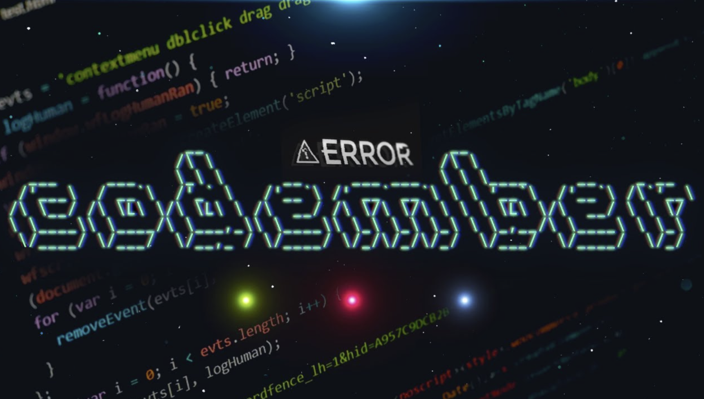

# Codember-2023
Mi repositorio con las soluciones del codember (de Midudev).

Retos

- [Reto_1](https://github.com/Pereirooo/Codember-2023-/blob/main/ContarPalabras/ContarPalabras.c)
- [Reto 2](https://github.com/Pereirooo/Codember-2023/blob/main/MiniCompiler/main.c)

Secretos

#### 1) Last-Name

- La persona oculta es el CEO de una gran empresa de hosting (empieza por V)-
- `name`No es lo mismo que `last-name`.

<!-- $ submit RAUCH -->

#### 2)🗓️ the-special-date 

- Mira el correo con el comando `mail`.
- Si deseas leer un email emplea `mail <id>`.
- Y no te equivoques!! fecha: YYYY-MM-DD.

<!-- $ submit 2023-12-01 -->

#### 3)🕹️ HotKeys

- `Triángulo, R2, Izquierda, L1, X, Derecha, Triángulo, Abajo, Cuadrado, L1, L1, L1` y de repente tienes todas las armas y munición infinita en el GTA
- Los secretcommands siempre estuvieron presentes en muchos juegos, entre ellos el tetris...
- Serás capaz de adivinar el correcto?

<!-- $ submit Up Up Down Down Left Right Left Right b a -->

#### 4)🎊 Fiesta!!

- `CHANGELOG.txt`, nunca está de más ver que nos trae la nueva versión
- Una fiesta sin confetti no es una fiesta
- El que es perseverante siempre alcanza sus objetivos.

<!-- $ confetti --Varias veces -->

#### 5)🪄 Magia
- `CHANGELOG.txt` si aún no lo has leído va siendo hora.
- No eres un verdadero mago si antes de sacar el conejo de la chistera no dices una palabra...
- (Todo junto y en minúsculas)

<!-- $ submit itsmagic -->

#### 6)🔮 Adivina Adivinanza

- Revisa el correo si aún no lo has hecho `mail`.
- Si quieres leer uno: `mail <id>`
- Respuesta: `submit <respuesta>`

<!-- $ submit html -->

#### 7)🤖 AI

- En los últimos años la ia a evolucionado mucho
- ¿Quien no ha salvado un trabajo gracias a ChatGPT?
- Como se llama su creador?

<!-- $ submit Altman-->

#### 8)🚀 Marte

- Primero debes saber como entrar en la carpeta private (mira el mail).
- Un mensaje de un astronauta, leelo con atención

<!-- $ submit majortom-->

#### 9)🛩️ Barrel roll

- Uno de los giros más típicos en aviación acrobática
- Pero con un do delante ;)

<!-- $ do a barrel roll-->

